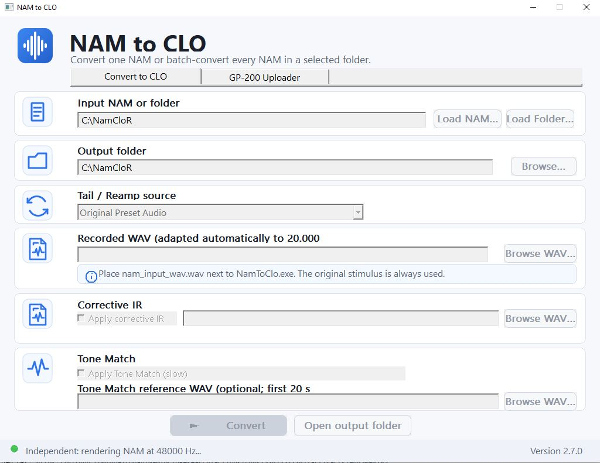
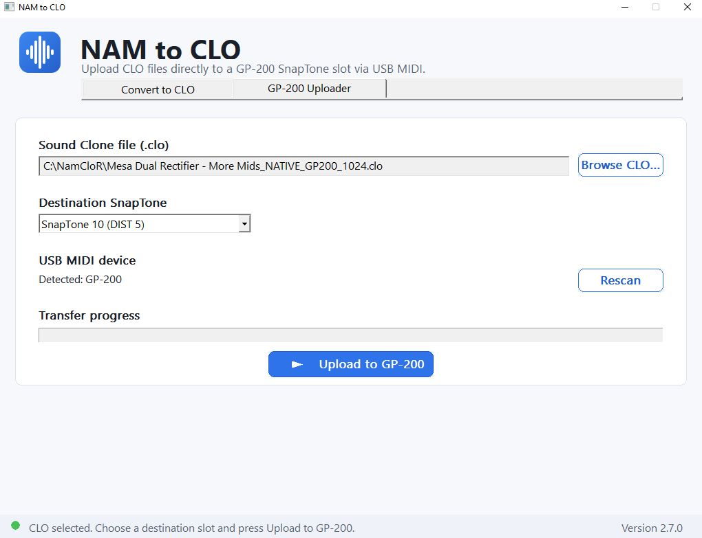

# NAM to CLO v2.7.0

Windows x64 application for converting Neural Amp Modeler (`.nam`) models to CLO files and uploading CLO files directly to Valeton GP-200 and GP-5 devices over USB MIDI.

The application has three tabs:

- **Convert to CLO** — convert one NAM model or every NAM model in a folder.
- **GP-200 Uploader** — upload an existing `.clo` file to one of the 10 GP-200 SnapTone slots.
- **GP-5 Uploader** — adapt a compatible CLO in memory to the GP-5 runtime format and upload it to **SnapTone 51-80**.

### GP-5 support in this release

GP-5 upload support was reconstructed from USB-MIDI captures of Valeton Suite and validated by successful physical uploads to a GP-5.

The current implementation intentionally exposes only **SnapTone 51-80**, the range validated during reverse engineering. The source CLO is never modified on disk: the GP-5 representation is created in memory immediately before transfer.

> This is an independent research/reimplementation project and is not affiliated with or endorsed by Valeton or Hotone.

## Quick start

1. Build or download `NamToClo.exe`.
2. Keep `nam_input_wav.wav` in the **same folder as `NamToClo.exe`**.
3. Open **Convert to CLO**.
4. Select a `.nam` file or a folder containing `.nam` files.
5. Select the output folder.
6. Leave the optional processing disabled for a standard conversion, or configure **Tail / Reamp**, **Corrective IR** and/or **Tone Match** as described below.
7. Press **Convert**.

The repository includes the required `nam_input_wav.wav`. The supplied file is a 70-second, 44.1 kHz, 16-bit PCM WAV. The application adapts it internally to the mono stimulus used by the converter.

---

## Convert to CLO



### Input NAM or folder

Use one of the two buttons:

- **Load NAM...** converts a single `.nam` model.
- **Load Folder...** batch-converts every `.nam` file found directly in the selected folder.

The selected path is shown in **Input NAM or folder**.

### Output folder

Choose where the generated CLO file or files will be written. **Open output folder** opens this location in Windows Explorer after conversion.

### Standard output

With **Tone Match disabled**, each NAM produces one GP-200 1024-tap CLO:

```text
<name>_NATIVE_GP200_1024.clo
```

No 2048-tap intermediate CLO is exported.

When converting a folder, the same settings are applied to every NAM in that folder.

---

## Required stimulus: `nam_input_wav.wav`

`nam_input_wav.wav` must be placed beside the executable:

```text
NamToClo.exe
nam_input_wav.wav
```

The converter always uses the original conversion stimulus. There is no stimulus-profile selector in the release version.

The stimulus contains two logical sections:

- **first 50 seconds** — fixed conversion stimulus;
- **final 20 seconds** — Tail / Reamp section.

The first 50 seconds always come from `nam_input_wav.wav`. The final 20 seconds are controlled by **Tail / Reamp source**.

---

## Tail / Reamp source

### Original Preset Audio

This is the default mode. The complete 70-second `nam_input_wav.wav` is used:

```text
0–50 s   original conversion stimulus
50–70 s  original preset/reamp tail
```

Use this for the normal conversion behavior.

### Recorded Audio

Choose **Recorded Audio** when you want to replace only the final 20-second Tail / Reamp section with your own WAV.

```text
0–50 s   original conversion stimulus
50–70 s  selected Recorded WAV
```

Press **Browse WAV...** and select the recording. The application adapts the selected file automatically:

- stereo or multichannel audio is downmixed to mono;
- common PCM and floating-point WAV formats are accepted;
- other sample rates are converted to 44.1 kHz;
- audio longer than 20 seconds is trimmed;
- audio shorter than 20 seconds is zero-padded.

The source file itself is not modified.

---

## Corrective IR

Enable **Apply corrective IR** to apply a corrective impulse-response WAV to the normal CLO result.

1. Tick **Apply corrective IR**.
2. Press **Browse WAV...**.
3. Select the corrective IR.
4. Convert normally.

The corrective stage is applied after the native NAM-to-CLO conversion and before the final GP-200 1024-tap CLO is written.

The generated filename remains:

```text
<name>_NATIVE_GP200_1024.clo
```

### Corrective IR and Tone Match together

When both options are enabled, the normal native conversion is completed first. The selected Corrective IR is then applied to the native CLO, and the same effective Corrective IR (including the CLO-side RMS normalization and post gain) is applied to the NAM render used as the Tone Match target. Tone Match therefore compares **NAM + Corrective IR** against **CLO + Corrective IR**, and refines the already-corrected CLO.

Using only Corrective IR or only Tone Match keeps the same behavior as before.

---

## Tone Match

Enable **Apply Tone Match (slow)** when you want the converter to perform the additional CLO refinement stage.

Tone Match is intentionally slower than the standard conversion.

When enabled, the normal CLO is not exported. The only result is:

```text
<name>_NATIVE_GP200_1024_TONEMATCH.clo
```

### Tone Match without a reference WAV

Leave **Tone Match reference WAV** empty. The converter uses the original conversion stimulus rendered through the NAM as the Tone Match target.

### Tone Match with a reference WAV

Use **Browse WAV...** under **Tone Match reference WAV** to select a different audio reference.

Only the **first 20 seconds** of the selected reference are used. The converter combines that reference with the fixed 50-second stimulus and renders the same test through the NAM before refining the CLO.

The reference WAV is adapted automatically in the same way as Recorded Audio: channel conversion, sample-rate adaptation, trimming and padding are handled by the application.

---

## Conversion status

The status bar at the bottom of the application reports the current operation. During NAM rendering and CLO fitting, the controls are temporarily disabled to prevent a second conversion from starting at the same time.

A successful single conversion produces exactly one `.clo` file. In batch mode, one final `.clo` is produced for each successfully converted NAM.

---

## GP-200 Uploader



The uploader sends an existing GP-200 compatible `.clo` file directly to a SnapTone slot through USB MIDI.

### 1. Connect the GP-200

Connect the GP-200 to the computer through USB and power it on before uploading.

Open the **GP-200 Uploader** tab. The application scans the available MIDI input and output ports and shows the detected device under **USB MIDI device**.

If the pedal was connected after opening the application, press **Rescan**.

### 2. Select the CLO

Press **Browse CLO...** and select the `.clo` file to upload. You can also drag a `.clo` file onto the application window while the Uploader tab is selected.

### 3. Select the destination SnapTone slot

Choose one of the ten GP-200 SnapTone destinations:

```text
SnapTone 1  (AMP 1)
SnapTone 2  (AMP 2)
SnapTone 3  (AMP 3)
SnapTone 4  (AMP 4)
SnapTone 5  (AMP 5)
SnapTone 6  (DIST 1)
SnapTone 7  (DIST 2)
SnapTone 8  (DIST 3)
SnapTone 9  (DIST 4)
SnapTone 10 (DIST 5)
```

Uploading replaces the CLO currently stored in the selected destination slot.

### 4. Upload

Press **Upload to GP-200**. The transfer progress bar and bottom status line show the current transfer state. Do not disconnect or power off the GP-200 while the upload is in progress.

---

## GP-5 Uploader

The **GP-5 Uploader** sends compatible CLO files directly to a Valeton GP-5 through USB MIDI.

The implementation was reconstructed from Valeton Suite traffic and then validated with successful uploads to a physical GP-5. It does **not** emulate Valeton Suite; it implements only the subset of the protocol required to upload a SnapTone.

### Supported destination range

The current release allows uploads only to:

```text
SnapTone 51
...
SnapTone 80
```

This is deliberate. SnapTone 51 and SnapTone 80 were captured and validated during reverse engineering, and the uploader is restricted to the validated range.

Internally the GP-5 uses zero-based slot numbering:

```text
SnapTone 51 -> 0x32
SnapTone 80 -> 0x4F
```

Attempts to upload outside this range are rejected by the application, not only hidden from the user interface.

### Compatible CLO files

The uploader accepts compatible **VTSI** or **HTSI** CLO files with:

```text
FIR A = 128 taps
FIR B = at least 512 taps
```

This includes:

- the **B1024 GP-200 CLO** generated by NamToClo;
- compatible **B2048 Valeton/Hotone/Ampero CLO** files.

For GP-5 transfer, the uploader uses the first 512 taps of FIR B. The original CLO file on disk is not changed.

### 1. Connect the GP-5

1. Connect the GP-5 to the computer through USB.
2. Power it on.
3. Open the **GP-5 Uploader** tab.
4. Confirm that the MIDI device is detected.
5. If the GP-5 was connected after NamToClo was opened, press **Rescan**.

Both MIDI input and MIDI output are required because the uploader waits for a device acknowledgement after every transfer block.

### 2. Select the CLO

Press **Browse CLO...** and select the file to upload.

You can also drag a `.clo` file onto the application while the **GP-5 Uploader** tab is active.

The selected source is adapted **in memory** immediately before transfer.

### 3. GP-5 CLO adaptation

The GP-5 transfer representation reconstructed from Valeton Suite uses:

```text
Magic          VTSI
FIR A          128 taps
FIR B          first 512 taps
Declared size  0x0A88
Payload size   0x0A00
```

The uploader updates the CLO layout fields and recalculates the internal **CRC16/MODBUS** automatically.

The compact CLO is then preceded by a reconstructed **74-byte SnapTone wrapper** containing the destination slot and name.

The complete transfer payload is:

```text
74-byte GP-5 wrapper
+
0x0A88-byte compact CLO
=
2770 bytes
```

### 4. Transfer protocol

The 2770-byte payload is divided into **146 blocks**:

```text
145 blocks x 19 bytes
1 final block x 15 bytes
```

Each block is sent using decoded command:

```text
0x92
```

The packet body is:

```text
[CRC8]
[0x92]
[sequence]
[payload length]
[payload]
```

The packet CRC is **CRC-8 polynomial 0x07**, initial value `0x00`, MSB-first.

Before transmission, every decoded byte is converted to two 4-bit nibbles and wrapped as MIDI SysEx:

```text
0xAB -> 0x0A 0x0B
```

### 5. ACK and retry handling

After each `0x92` block, the uploader waits for the GP-5 acknowledgement:

```text
B2 01 00 03 14 08 00
```

Only after that ACK is received does the uploader continue with the next block.

If the ACK is not received in time, the same sequence block is retried automatically. The transfer is aborted after the retry limit is reached.

This ACK-driven transfer avoids relying on long fixed delays between blocks.

### 6. Final completion

After the final block, the uploader waits for the GP-5 completion notification observed in the captured transfers:

```text
CE 01 00 06 12 1B 03 00 00 00
```

When this message is received, the upload is reported as successfully completed.

### Confirmed vs inferred protocol details

**Confirmed from captures and physical testing:**

- command `0x92` carries the SnapTone transfer blocks;
- 19-byte block payloads are used, with a shorter final block;
- each block is acknowledged by `B2 01 00 03 14 08 00`;
- the packet uses CRC-8 polynomial `0x07`;
- SysEx data is nibble-encoded;
- the GP-5 runtime CLO uses A128/B512;
- SnapTone 51 maps to `0x32`;
- SnapTone 80 maps to `0x4F`;
- the complete uploader works on physical GP-5 hardware.

**Strongly supported by the captures:**

- `CE 01 00 06 12 1B 03 00 00 00` is the post-transfer completion notification.

The application intentionally does **not** reproduce the complete Valeton Suite startup and state synchronization because the captured uploads begin the SnapTone transfer directly with command `0x92`. Only the protocol needed for the upload is implemented.

---

## File layout for a release

A minimal usable folder is:

```text
NamToClo.exe
nam_input_wav.wav
```

No external runtime folder is required for the Convert to CLO tab.

GP-200 and GP-5 upload support is built into the executable; no separate MIDI runtime or Valeton Suite installation is required.

---

## Build from source

Requirements:

- Windows x64
- CMake 3.24 or newer
- Visual Studio / MSVC with C++ desktop development tools

Build with:

```powershell
cmake --preset windows-x64
cmake --build build --config Release --parallel
```

The executable is generated by the CMake build in the Release output directory.

---

## Licensing

See [`LICENSE`](LICENSE) for the project license and [`THIRD_PARTY.md`](THIRD_PARTY.md) for third-party components and their licenses.

## Tone3000 real-time NAM preview (v2.9.3)

When a Tone3000 NAM is loaded, choose a **mono WAV** in the Tone3000 tab with
`Browse WAV...`. There is no fixed/default preview file. The WAV can be stored anywhere
on disk; it is preloaded into RAM and fed through the selected NAM in real time. Standard
PCM (8/16/24/32-bit) and IEEE-float (32/64-bit) mono WAV files are accepted and their
sample rate is resampled as needed for the NAM preview.

`Replay preview` resets the NAM and starts the selected WAV from the beginning. `Stop`
stops the streaming playback.

The v2.9.3 build uses the standard Windows multimedia output selected as the
Windows default device. This keeps the MIT project free of the separately
licensed Steinberg ASIO SDK. A Focusrite can be used directly by selecting its
Windows playback endpoint as the default output device. Direct ASIO-host support
can be added later as an optional build once the ASIO SDK licensing/distribution
choice is made.

### Tone3000 downloaded file names (v2.9.2)

Tone3000 models are stored using the model's human-readable name instead of the numeric model ID. For example, `VH4 CH3 G6.5` is saved as `VH4 CH3 G6.5.nam`. Windows-invalid filename characters are replaced with `_`. Because CLO output names are derived from the input NAM stem, converted CLO files use the same model name automatically.


## Tone3000 UI status fix (v2.9.4)

The Tone3000 status line is now painted with an opaque card background and forced to one line, preventing previous status messages from accumulating visually above the Preview WAV row.


### Tone3000 temporary NAM cleanup (v2.9.5)
Each NAM downloaded from Tone3000 is registered as temporary. If a CLO conversion of that NAM succeeds, it is removed from the temporary list and the NAM is kept. At normal shutdown, and again on the next startup after an interrupted session, only registered downloads that were never successfully converted are deleted. Generated `.clo` files, successfully converted Tone3000 NAMs, manually opened NAMs, and cache files created by older versions are not deleted.

## v2.9.6
- GP-5 uploader UI now identifies itself as GP-5/GP-50 and MIDI detection explicitly accepts `gp-5`, `gp5`, `gp-50`, and `gp50`, while keeping the existing shared upload protocol unchanged.
- Tone Match is now always enabled for conversions. The UI only selects between the built-in/default reference audio path and a custom WAV reference. Custom WAV keeps the existing first-20-seconds behavior.


## v2.9.7

Tone3000 preview adds an optional cabinet IR loader. IR WAVs are accepted at any sample rate and canonicalized to 48 kHz using the existing r8brain resampler; 48 kHz IRs are used directly. If a NAM requires another processing rate, the canonical 48 kHz IR is adapted internally only for the realtime convolution stage. Stereo/multichannel IR WAVs are downmixed to mono, while preview guitar WAVs remain mono-only. The IR is applied after the NAM in the preview signal chain, and the Preview row has been moved down in the Tone3000 tab.


### v2.9.8 - Fixed 48 kHz Tone3000 preview path
The Tone3000 realtime preview now runs on a fixed 48 kHz processing path. Preview WAV audio is resampled to 48 kHz when necessary, cabinet IRs are canonicalized to 48 kHz once when loaded, and no second IR resampling is performed before convolution.


### v2.9.9 build fix
The realtime preview IR interface is synchronized between `nam_preview_player.hpp` and `nam_preview_player.cpp`. The modified-files package now includes both files, fixing C2511/C2039 build errors when applying the incremental update over an older tree.


### v2.9.10 build compatibility fix
The modified-files package now includes `src/gui.cpp`, keeping the Tone3000 IR preview UI in sync with `nam_preview_player.hpp/.cpp`. A backward-compatible 3-argument `NamPreviewPlayer::load()` overload is also provided so older GUI call sites compile and simply preview without an IR.
