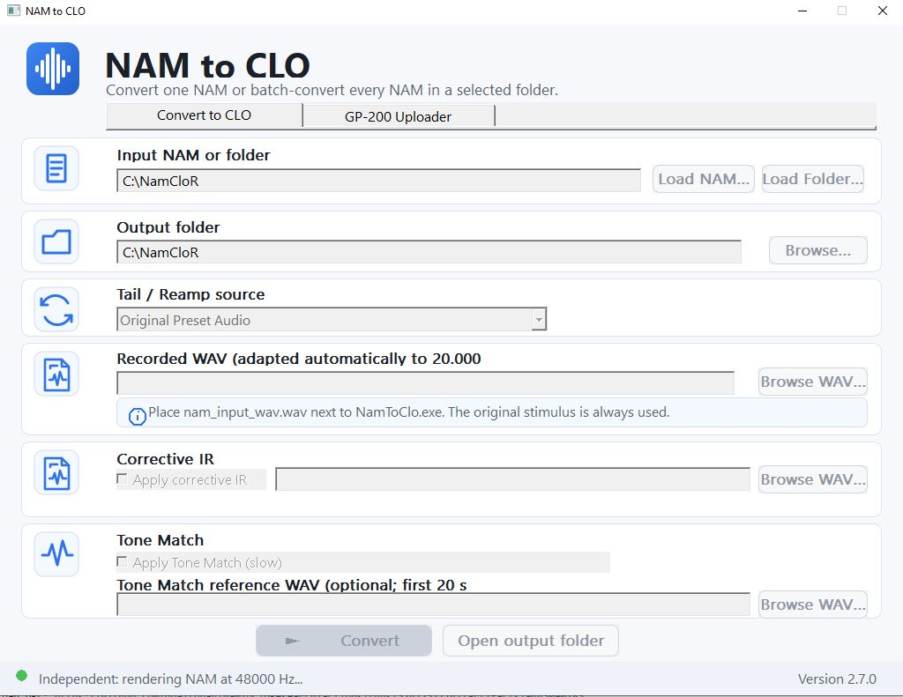
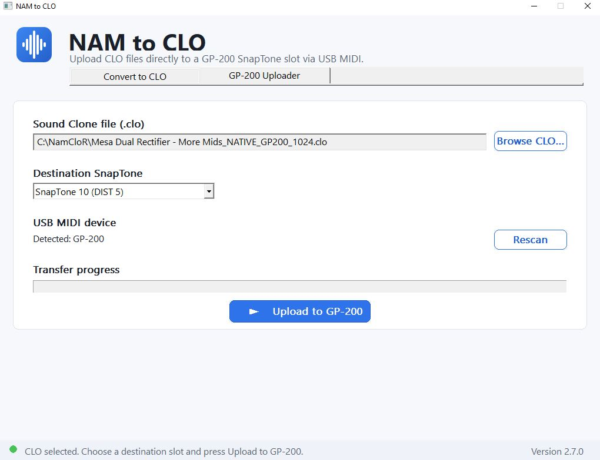

> This is an independent research/reimplementation project and is not affiliated with or endorsed by Valeton or Hotone.

# NAM to CLO User Guide

NamToClo converts Neural Amp Modeler (`.nam`) models into CLO files for Valeton GP-200 and GP-5/GP-50 SnapTone slots. It also includes a Tone3000 tab for finding and downloading NAM captures.

## Quick start

1. Put `NamToClo.exe` and `nam_input_wav.wav` in the same folder.
2. Open NamToClo and choose **Convert to CLO**.
3. Select a NAM file with **Load NAM...**, or choose **Load Folder...** to convert the NAM files directly inside one folder.
4. Choose an output folder.
5. Select the destination format: **GP-200 (B1024)** or **GP-5 (B512)**.
6. Set the optional Tail / Reamp and Corrective IR inputs. Tone Match is applied automatically; choose its reference audio if needed.
7. Press **Convert** and wait for the completion message.

The included `nam_input_wav.wav` is the required conversion stimulus. Keep it beside the executable whenever you run a conversion.

## Convert to CLO



### Choose the destination

- **GP-200 (B1024)** creates an A128/B1024 CLO.
- **GP-5 (B512)** creates an A128/B512 CLO for the GP-5/GP-50 upload format.

Tone Match is always performed. The resulting file name ends in `_TONEMATCH.clo`; for example:

```text
<model>_NATIVE_GP200_1024_TONEMATCH.clo
<model>_NATIVE_GP5_512_TONEMATCH.clo
```

When converting a folder, the selected settings are used for each NAM file. Each successful conversion produces one final CLO file.

### Tail / Reamp source

The conversion stimulus has a fixed first 50 seconds and a final 20-second Tail / Reamp section.

- **Original Preset Audio** keeps the original 70-second stimulus, including its final 20 seconds.
- **Recorded Audio** replaces only the final 20 seconds with a WAV you select using **Browse WAV...**.

The application downmixes multichannel recordings to mono, converts their sample rate as needed, trims audio longer than 20 seconds, and pads shorter audio with silence. Your recording is not modified.

### Corrective IR

Corrective IR is optional. To use one, enable **Apply corrective IR**, select its WAV with **Browse WAV...**, then convert. WAV files at other sample rates are resampled internally. The IR is applied to the conversion and, when Tone Match runs, to the NAM reference render as well so both sides of the comparison use the same correction.

### Tone Match reference

Tone Match is always on. Select the reference source in the Tone Match control:

- **Reference audio** uses the converter's standard stimulus.
- **Custom WAV** lets you select a different reference with **Browse WAV...**. The first 20 seconds are used in the Tail / Reamp portion of the test stimulus. The application adapts the audio format and sample rate as needed.

## Tone3000

Use the **Tone3000** tab to sign in, search captures, browse results, and download a NAM model. Load or convert the downloaded model from the **Convert to CLO** tab like any other NAM file.

## GP-200 Uploader



The GP-200 uploader sends an existing CLO file to one of the pedal's ten SnapTone destinations.

1. Connect and power on the GP-200, then open **GP-200 Uploader**.
2. Check that the USB MIDI device is detected. Press **Rescan** if you connected the pedal after opening NamToClo.
3. Select a CLO with **Browse CLO...**, or drag a CLO onto the application while this tab is open.
4. Choose the destination slot, **SnapTone 1–10**.
5. Press **Upload to GP-200** and wait for completion before disconnecting or powering off the pedal.

Uploading replaces the model in the selected slot.

## GP-5 / GP-50 Uploader

The GP-5/GP-50 uploader supports **SnapTone 51–80**. The selected CLO must contain FIR A with 128 taps and FIR B with at least 512 taps. NamToClo adapts the transfer data in memory; it does not change the source CLO on disk. Longer FIR B data is reduced to the first 512 taps for transfer.

1. Connect and power on the GP-5 or GP-50, then open **GP-5/GP-50 Uploader**.
2. Confirm that the USB MIDI device is detected. Press **Rescan** if needed.
3. Select a compatible CLO with **Browse CLO...**, or drag it onto the application while this tab is open.
4. Choose a destination from **SnapTone 51–80**.
5. Press **Upload to GP-5/GP-50** and wait for the completion message before disconnecting the pedal.

The uploader requires MIDI input and output so it can receive the pedal's acknowledgements during transfer. Files outside the supported CLO structure and destination range are rejected.

## Files needed to run the application

For conversion, keep these files together:

```text
NamToClo.exe
nam_input_wav.wav
```

No separate MIDI runtime or Valeton Suite installation is required for uploads. For license information, see [`LICENSE`](LICENSE) and [`THIRD_PARTY.md`](THIRD_PARTY.md).
